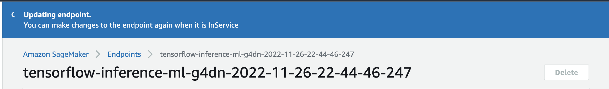
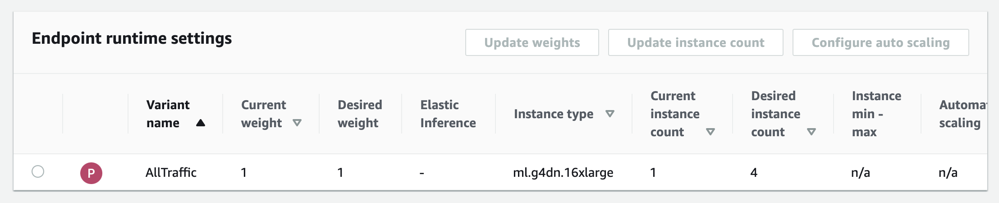
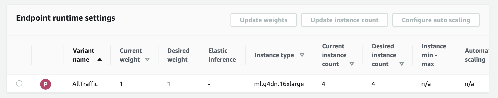
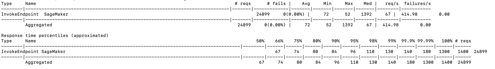
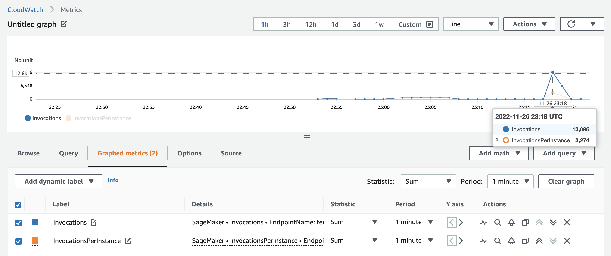

# AIM406: Tune performance and optimize ML inference using Amazon SageMaker

In this repository we will explore the testing and tuning process of maximizing performance of a TensorFlow model on a SageMaker Real-Time Endpoint. In this repository the following code samples and artifats are shared:

- <b>Notebook</b>
  - TensorFlow U-Net 50 SageMaker Real-Time Endpoint Creation & Inference
  - TensorFlow Serving Container Environment Variable Tuning
  - Neo Compilation
  - AutoScaling
  
- <b>Distributed Locust Scripts</b>: The load test we will be running live for the demo. For this example we will run this on an EC2 instance (c6i.32xlarge), but you can run on your own client side setup as long as it has the necessary compute power to handle the load you want to test at. We will be using Locust for this example as our third party testing tool.

  - locust_script.py: Contains the stress testing code with your sample inference/invoke, you can alter this to invoke multiple different payloads if you want.
  - distributed.sh: Sets up distributed locust, you can tune workers and users to further increase the transactions per second from the test.

NOTE: This repository assumes understanding of AWS and SageMaker Inference fundamentals. While the steps to deploy a SageMaker endpoint are shown, if you would like a deeper understanding of deploying models on SageMaker reference this [blog](https://aws.amazon.com/blogs/machine-learning/getting-started-with-deploying-real-time-models-on-amazon-sagemaker/). Furthermore, we will be testing with a third party tool known as Locust for stress testing so please reference their [documentation](https://docs.locust.io/en/stable/index.html) and this [repository](https://github.com/aws-samples/load-testing-sagemaker-endpoints) to get started.


# Steps
There are two main parts to this example, creating and optimizing the endpoint on the SageMaker Notebook and the running tests with [Locust Distributed](https://docs.locust.io/en/stable/running-distributed.html) on an EC2 client machine.

## SageMaker Notebook + Endpoint Setup

### Endpoint Creation & TF Serving Tuning

[TensorFlow Model Optimization Blog](https://aws.amazon.com/blogs/machine-learning/maximize-tensorflow-performance-on-amazon-sagemaker-endpoints-for-real-time-inference/)
[TensorFlow Serving SageMaker Container](https://github.com/aws/sagemaker-tensorflow-serving-container/blob/master/docker/build_artifacts/sagemaker/serve.py#L40-L70)

```

# Tune the necessary environment variables for your serving container
sm_model = Model(model_data=model_data, framework_version=framework_version, role=role,
                 env= {
                    'SAGEMAKER_GUNICORN_WORKERS': '64',
                    'SAGEMAKER_TFS_INTER_OP_PARALLELISM': '1',
                    'SAGEMAKER_TFS_INTRA_OP_PARALLELISM': '1',
                    'SAGEMAKER_TFS_INSTANCE_COUNT': '8'})

uncompiled_predictor = sm_model.deploy(initial_instance_count=1, instance_type=instance_type)
```


### Neo Compilation

[Neo Compilation Original Example Credit](https://github.com/aws/amazon-sagemaker-examples/blob/main/aws_sagemaker_studio/sagemaker_neo_compilation_jobs/tensorflow_unet/sagemaker-neo-tf-unet.ipynb)
[Neo Compilation Docs](https://sagemaker-examples.readthedocs.io/en/latest/aws_sagemaker_studio/sagemaker_neo_compilation_jobs/tensorflow_unet/sagemaker-neo-tf-unet.html)

```
data_shape = {"inputs": [1, 224, 224, 3]}
instance_family = "ml_g4dn"
compilation_job_name = name_from_base("medical-tf-Neo")
compiled_model_path = "s3://{}/{}/output".format(bucket, compilation_job_name)

optimized_estimator = sm_model.compile(
    target_instance_family=instance_family,
    input_shape=data_shape,
    job_name=compilation_job_name,
    role=role,
    framework=framework.lower(),
    framework_version=framework_version,
    output_path=compiled_model_path,
)
```

### Enable AutoScaling on SageMaker Endpoint

```
# AutoScaling client
asg = boto3.client('application-autoscaling')

# Resource type is variant and the unique identifier is the resource ID.
resource_id=f"endpoint/{endpoint_name}/variant/AllTraffic"

# scaling configuration
response = asg.register_scalable_target(
    ServiceNamespace='sagemaker', #
    ResourceId=resource_id,
    ScalableDimension='sagemaker:variant:DesiredInstanceCount', 
    MinCapacity=1,
    MaxCapacity=4
)

#Target Scaling: Once invocations reach 10, the instance will scale out to 4 within 30 seconds and cool back down in 500 seconds.
response = asg.put_scaling_policy(
    PolicyName=f'Request-ScalingPolicy-{endpoint_name}',
    ServiceNamespace='sagemaker',
    ResourceId=resource_id,
    ScalableDimension='sagemaker:variant:DesiredInstanceCount',
    PolicyType='TargetTrackingScaling',
    TargetTrackingScalingPolicyConfiguration={
        'TargetValue': 10.0, # Threshold
        'PredefinedMetricSpecification': {
            'PredefinedMetricType': 'SageMakerVariantInvocationsPerInstance',
        },
        'ScaleInCooldown': 500, # duration until scale in
        'ScaleOutCooldown': 30 # duration between scale out
    }
)
```

### Test with requests to see Scale out

```
request_duration = 400
end_time = time.time() + request_duration
print(f"test will run for {request_duration} seconds")
while time.time() < end_time:
    response = runtime.invoke_endpoint(EndpointName=endpoint_name, 
                                   ContentType='application/json',     
                                   Body=payload)
```






## Setting up EC2 Instance for Locust Load Tests

To get started have an EC2 instance up and running, in the case of this example we used an ml.c6i.32xlarge instance. You can launch multiple EC2 instances to further get client side power to ramp up traffic. This script is not just EC2 reliant, if you want you can run this on EKS or even a SageMaker Notebook Instance, just be aware of the client compute power you have so that you do not get throttled on that end. For launching and setting up an EC2 instance follow this [documentation](https://docs.aws.amazon.com/AWSEC2/latest/UserGuide/LaunchingAndUsingInstances.html).

### SSH into Instance and setup Locust in a Python Virtual Environment

```
virtualenv venv #venv is the virtual environment name, you can change as you desire
source venv/bin/activate #activate virtual environment
pip install locust
```

### Configure AWS CLI
We need the AWS CLI to work with S3 or any other AWS services, S3 contains our model data and payload for inference.

```
aws configure

aws s3 cp s3://{bucket}/unet-payload.txt unet-payload.txt
```

### Setup Locust Script
This is the locust_script.py file that you can adjust, the invoke_endpoint call is what will vary if you change your endpoint, this is the task the Locust test focuses on.

```
response = self.sagemaker_client.invoke_endpoint(
                EndpointName=self.endpoint_name,
                Body=self.payload,
                ContentType=self.content_type
            )
            response_body = response["Body"].read()
```

### Run Distributed Locust

The distributed.sh script contains the environment variables such as endpoint name, payload, and etc that we inject into our Locust script. Within Locust Distributed we have one master and multiple workers. The master worker instructs the workers on how to spawn/control the concurrent users that are sending a request. In our distributed.sh script we see by default that 240 *users* that will be distributed across the 60 *workers*. We can increase load by tuning these two parameters in specific.

```
./distributed.sh {endpoint_name}
```



We can also monitor this all through the CloudWatch invocation metrics.


